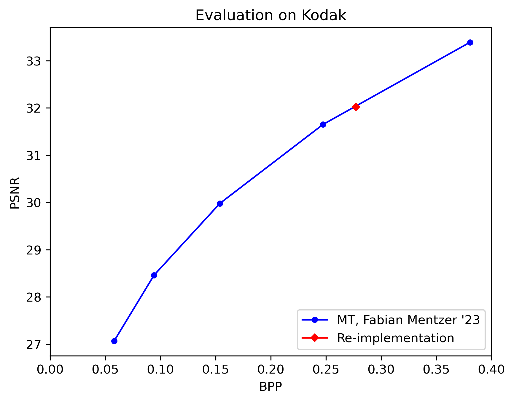

This repo is an implementation for [M2T: Masking Transformers Twice for Faster Decoding](https://openaccess.thecvf.com/content/ICCV2023/html/Mentzer_M2T_Masking_Transformers_Twice_for_Faster_Decoding_ICCV_2023_paper.html) in **pytorch**.

## Install

The latest codes are tested on Ubuntu18.04LTS, CUDA11.7, PyTorch1.9 and Python 3.7.
Some libraries are required to run the codes in this repo, including [constriction](https://bamler-lab.github.io/constriction/), [compressai](https://github.com/InterDigitalInc/CompressAI), and [timm](https://timm.fast.ai/).

### Train
```python
python train.py --config config/mt.yaml # --wandb (if you want to use wandb)
```
Model checkpoints and logs will be saved in `./history/MT`.

### Test
```python
python train.py --config config/mt.yaml --test-only --eval-dataset-path: 'path_to_kodak'
```
### Performance
Red dot is our reproduction with distortion lambda $\lambda=0.0035$.
<p align='center'>
    
</p>

### Pretrained models
To be released.

### Acknowledgements
We use constriction for actual entropy coding. Thanks for Fabian Mentzer's help for the clarification of the details of the paper.